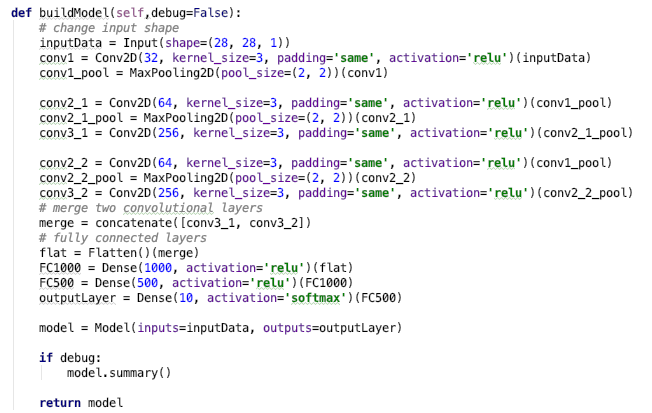
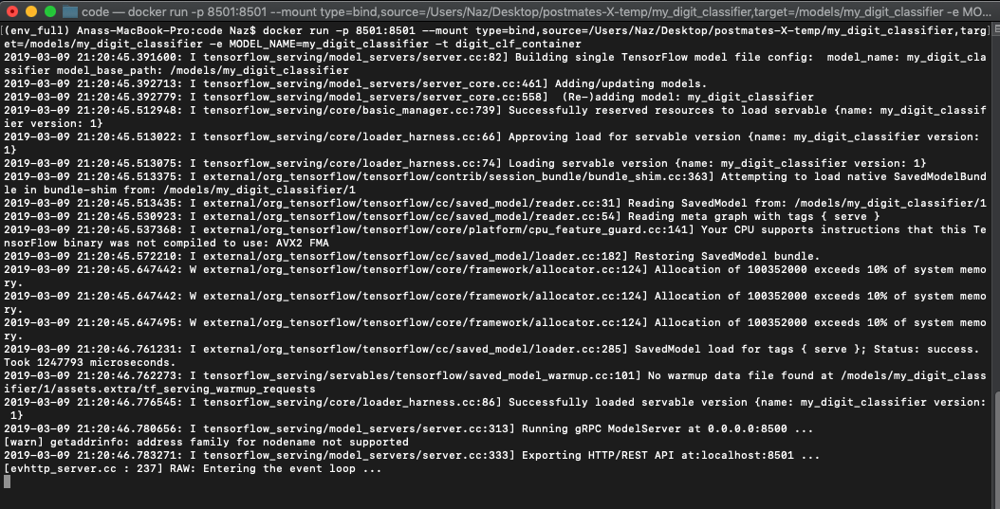
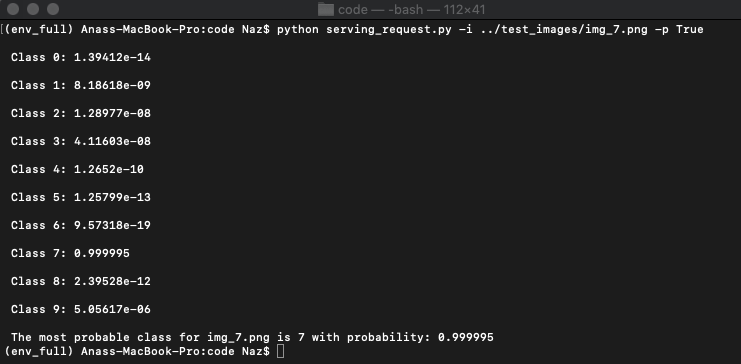
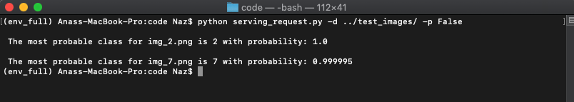

    Author : Anas Mahmoud

# Introduction

In this project, we implement, train and evaluate an MNIST classifier. This document presents instructions on how to train and evaluate the model. Moreover, a brief description on how to deploy the model within an inference server is presented. We also provide a script that can be used to send requests to the inference server and classify a single image or a directory of images. The script returns the most probable class and optionally the probabilities associated with all classes with respect to the input image. We also include an appendix section detailing the structure of the submitted files.

## Dimensions and Examples from Dataset

Dimensions of Training set images:  (60000, 28, 28)
Dimensions of Testing set images:  (10000, 28, 28)

# Model Description

|Layer (type)                  | Output Shape     | Param #   |Connected to     |
| -----------------------------|:----------------:| ---------:|----------------:|
|input_1 (InputLayer)          |(None,28,28,1)|0          |    N/A          |
|conv2d_1 (Conv2D)             |(None,28,28,32)|320        |input_1[0][0]    |
|max_pooling2d_1 (MaxPooling2D)|(None,14,14,32)|0          |conv2d_1[0][0]   |
|conv2d_2 (Conv2D)             |(None,14,14,64)|18496      |max_pooling2d_1[0][0]|
|conv2d_4 (Conv2D)             |(None,14,14,64)|18496      |max_pooling2d_1[0][0]|
|max_pooling2d_2 (MaxPooling2D)|(None,7,7,64)  |0          |conv2d_2[0][0]|
|max_pooling2d_3 (MaxPooling2D)|(None,7,7,64)  |0          |conv2d_4[0][0]|
|conv2d_3 (Conv2D)             |(None,7,7,256) |147712     |max_pooling2d_2[0][0]|
|conv2d_5 (Conv2D)             |(None,7,7,256) |147712     |max_pooling2d_3[0][0]|
|concatenate_1 (Concatenate)   |(None,7,7,512) |0          |conv2d_3[0][0] AND conv2d_5[0][0]|
|flatten_1 (Flatten)           |(None,25088)     |0          |concatenate_1[0][0]|
|dense_1 (Dense)               |(None,1000)      |25089000   |flatten_1[0][0]|
|dense_2 (Dense)               |(None,500)       |500500     |dense_1[0][0]|
|dense_3 (Dense)               |(None,10)        |5010       |dense_2[0][0]|

Trainable params: 25,927,246

# Training and Evaluation Step

* Create a virtual environment that contains python 3.6 as the base interpreter and contains tensorflow, keras and opencv packages
* Activate the environment:
  * source activate {environment_name}
* To train and evaluate the model, run the following commands:
   * cd DigitClassifierProject/code
   * python *model_trainer.py*
   * Below is a snippet of the model:
       
* The *model_trainer.py* trains the model on 60,000 images for 5 epochs, and evaluates
the model on 10,000 images. The script also saves the model into an .h5 format,
so we can later export it to a binary format for deployment.
* A *cnnModel.h5* file is generated in the code directory.
* We use misclassifications as a measure of accuracy because dataset is balanced.
* Accuracy over training set is: *99.40%*
* Accuracy over testing set is: *98.89%*

# Deployment
## Exporting the model
* To export the model run:
  * cd DigitClassifierProject/code
  * python *export_model.py*
* The *export_model.py* contains an export_path variable which has the following
format:
  * modelName->classifierVersion (modelName=my_digit_classifier, classifierVersion=1)
* After running the exporting script, the output is a directory named my_digit_classifier,
inside this directory, is a subdirectory, representing the version of the classifier.
*  Inside the subdirectory is:
  * *save_model.pb* : which includes one or more graph definitions of the model,
  as well as metadata of the model such as signatures.
  * *variables* are files that hold the serialized variables of the graphs.

## Setting up an Inference Server

* Install docker desktop https://www.docker.com/products/docker-desktop
* Download the tensorflow docker images:
  * docker pull tensorflow/serving
* tensorflow/serving will serve as a base image that we will use inside a container that contains
our model

To create our own serving image:
* First run a serving image as a daemon:
    + docker run -d --name serving_base tensorflow/serving
* copy your SavedModel to the container's model directory:
    + docker cp models/{my model} serving_base:/models/{my model}
    + models/{my model} has to be a FULL path to my_digit_classifier
    +  Example : docker cp /Users/Naz/Desktop/DigitClassifierProject/my_digit_classifier  serving_base:/models/my_digit_classifier
* commit the container that's serving your model by changing MODEL_NAME to match your model's name:
    + docker commit --change "ENV MODEL_NAME {my model}" serving_base {my container}
    + Example : docker commit --change "ENV digitClassifier my_digit_classifier" serving_base digit_clf_container
* Kill the running container 'serving_base'
    + docker kill serving_base
* This will leave us with a Docker image called *digit_clf_container* that we can deploy and will load our model

## Serving

* Run the container *digit_clf_container* and open the REST API port (8501):
    * docker run -p {port_ID}:{port_ID} --mount type=bind,source={full_path_to_classifier_folder},target=/models/{classifier_name} -e MODEL_NAME={classifier_name} -t {container_name}
    * Example: docker run -p 8501:8501 --mount type=bind,source=/Users/Naz/Desktop/DigitClassifierProject/my_digit_classifier,
    target=/models/my_digit_classifier -e MODEL_NAME=my_digit_classifier -t digit_clf_container
    * The output looks like this:
    

Start another terminal to send a request through port 8501. The script *serving_request.py* accepts two main arguments used to either process a single request for classifying an image (using option -i), or send several requests to classify a directory of images (using option -d). Moreover, if the user is not just interested in the most probable class, but is also interested in viewing the probabilities of all classes, then setting option -p to 'True' will print probabilities of all classes. In all cases, the script returns the most probable class and its probability.
* To process a single image, you send a single request by:
 * cd DigitClassifierProject/code
 * python serving_request.py -i <full path to image> -d True
 * Example: serving_request.py -i ../test_images/image_7.png -d True
 * The output looks like this:
 

* To process a directory of images, you send multiple requests (we have only two images in subdirectory test_images):
 * cd DigitClassifierProject/code
 * python serving_request.py -i <full path to directory> -d False
 * Example: serving_request.py -i ../test_images/image_7.png -d False
 * The output looks like this:
  
* To change the version of the classifier, we would need to edit the request command in the *serving_request.py*
 * current request command : requests.post('http://localhost:8501/v1/models/my_digit_classifier:predict', json=payload)
 * Where, 8501 is the port ID, v1 is the version number and my_digit_classifier is the name of the model

# Appendix

The structure of the submitted directory is as follows:

* The 'code' directory contains:
  * *model_trainer.py* : A script to train and evaluate the model.
  * *export_model.py*: A script to export the model.
  * *serving_request.py*: A script to send requests to the server.
  * *cnnModel.h5*: the digit classifier model used for exporting in later steps.
* The 'my_digit_classifier' directory contains the exported model.
* The 'test_images' directory contains 2 test images from classes 2 and 7.
* The 'figures' directory contains figures used for illustration in this report.
* The 'Instructions.md' file contains source code for this document.
* The 'Instructions.pdf' is a pdf format generated from 'Instructions.md'  
